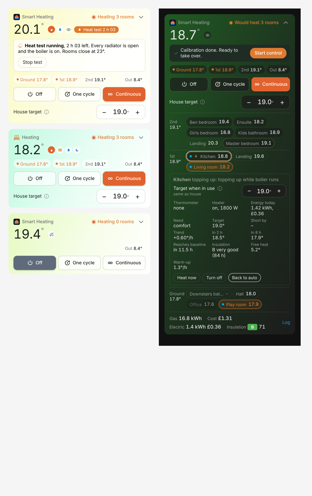

# Smart Heating

[](https://hacs.xyz)
[](https://github.com/albert-canfield/smart_heating/actions/workflows/validate.yml)
[](https://github.com/albert-canfield/smart_heating/releases)


[](https://my.home-assistant.io/redirect/hacs_repository/?owner=albert-canfield&repository=smart_heating&category=integration)

A Home Assistant integration that heats a house room by room with two voices:

- **Need**: does a room need heat? Safety floor, day/night baseline, comfort when a room is in use.
- **Efficiency**: is it worth burning gas now? Season gate, coasting, heat rising from lower floors, batching small demand, hot water priority, boiler min run/off.

The boiler fires only when a need is approved. TRVs act as valves (open / closed) and only move when the boiler is about to run or is running.

Version 0.9.6. Lifecycle:

1. **Calibrating** (monitor only, locked): learns each room's heat-loss time constant, free-heat gain and warm-up rate from normal life. Decides and logs, never touches the boiler or TRVs.
2. **Ready**: a notification says calibration is done (Home Assistant notification, plus your phone if a notify service is set). Monitor only can now be turned off.
3. **Controlling**: drives the boiler and TRVs.

### Calibration in short

| Question | Answer |
|---|---|
| What does it need? | Per room: about 24 h of **cooling data** (boiler off for at least 1 h), a 2° **range** in the inside/outside gap, and about 2 h of **heating data** (boiler on, radiator open). Done when 80% of rooms have all three. |
| How long? | Usually 1 to 3 days. The card shows progress, what it's collecting now, and roughly how long is left: tap the **Calibrating** badge. |
| Can I use it meanwhile? | It only watches and logs. Keep your existing heating as it is. |
| How do I speed it up? | Tap **Run heat test** on the card (about 2 h: every radiator open, boiler on, rooms capped at 23°, then the house cools). Pause your own heating schedule while it runs. Leave the heating off overnight: each night gives up to 10 h of cooling data. |
| When it's done? | A notification arrives and the card shows **Start control**. Tap it. |
| Can I skip it? | Yes: **Start now without calibration** on the card, or *Skip calibration* in Configure. Defaults are used; learning continues in the background. |

Only real radiator heat counts: burns for hot water only (cylinder with the heating valve shut, or a combi running a tap) are treated as cooling time. Progress is saved, so restarts don't lose it.

### Setting temperatures

On the card, when the mode is One cycle or Continuous:
- **House target** (− 19.0 +) moves every room together, plus the day and night baselines. The frost floor never moves.
- Tap a room for its own **Target when in use**. It keeps its difference from the house when the house target moves. Rooms without a TRV still ask for heat, but their radiator can't be shut.

Both are also entities (`number.smart_heating_house_target`, `number.<room>_target`) for automations. A new comfort set in a room's Reconfigure form replaces the card setting.

## Works with what you have

Setup asks **"What heats your home?"** first and then only what that setup needs:

| Heating | Typical kit | What Smart Heating does |
|---|---|---|
| **Boiler with a hot water tank** (also known as S-plan or Y-plan) | relay or thermostat, TRVs, tank sensor | Rooms vote, boiler fires for approved rooms, TRVs open and close as valves. Optional hot water first |
| **Combi boiler** (no tank) | thermostat or relay, TRVs | Same, without the hot water pause: the boiler already serves taps first |
| **Electric heaters only** | smart plugs on plain heaters, or smart heaters (`climate`) | Each room switches its own heaters; no boiler timing. Energy and cost tracked per room |
| **Boiler plus some electric heaters** | both | Electric-only rooms never fire the boiler. A room with a radiator and a heater uses the heater when it's the only room calling, instead of firing the whole boiler |

Combinations that work:
- **Thermostat + smart TRVs** (combi or tank): full room-by-room control. In *Setpoint* style the thermostat is nudged above its own reading when a TRV room calls, so it fires even if its own room is warm.
- **Thermostat + plain TRVs**: single zone, the thermostat gets the target, or the frost floor when off.
- **Relay only** (e.g. a Shelly on the boiler): single zone, on/off.
- **TRVs only**: valves are controlled, the boiler stays on its own thermostat.

Thermostat style: **Setpoint** (recommended: it gets the target and regulates, so it stays sensible if Home Assistant stops) or **On / off** (heat at 25° or off).

Electric heaters: a smart plug is switched on/off; a smart heater gets the room target and hvac off when not needed. Enter the heater's power (e.g. 2000 W) and optional eco power (e.g. 1000 W, used when a smart heater reports an eco preset). If the plug or heater has its own power sensor it is found automatically and measured power is used instead. Sensors: electricity today (kWh, with a projection to midnight), cost today, and per-room energy today.

Other fallbacks:
- **No room thermometer**: the TRVs' or smart heaters' own reading is used (less accurate near the radiator).
- **No outdoor sensor or forecast**: season gate and calibration are skipped, control is allowed straight away, predictions stay empty.
- **No presence, lights or media**: rooms use their comfort schedule and manual "Heat now".
- **No gas meter**: gas is estimated from boiler runtime, flagged as an estimate.
- **No away source**: away mode is never triggered; use the mode buttons.
- **No night schedule**: 22:00 to 07:00, changeable in Configure.
- **No areas or floors in HA**: rooms can still be added; floor is then picked in the room form.



## Install

**HACS (recommended):** use the button above, or HACS, then ⋮, then Custom repositories, add `https://github.com/albert-canfield/smart_heating` as type *Integration*, install **Smart Heating** and restart Home Assistant.

**Manual:** copy `custom_components/smart_heating` into `/config/custom_components/` and restart.

Brand icon and logo ship in `brand/` (shown by Home Assistant 2026.3 and later).

The dashboard card ships inside the integration: it is served and loaded on every dashboard automatically, with no resource to add and no file in `www`. After an update, a normal browser refresh picks up the new card.

## Set up

Settings, Devices & services, Add integration, Smart Heating. A short wizard:

1. **What heats your home?**
2. **Your boiler**: the relay, switch or thermostat for heating, and optionally a boiler running sensor (skipped for electric).
3. **Your thermostat**: Setpoint or On / off (only if the boiler control is a thermostat).
4. **Hot water**: tank heating sensor and *Hot water first* (tank and hybrid only).
5. **Outside temperature**: weather forecast and/or an outdoor sensor.
6. **Optional extras**: away detection, night schedule, gas meter.
7. **Rooms**: areas with a thermometer, TRV or heater are pre-ticked and become rooms in one go.

Everything can be changed later: **Reconfigure** repeats the wizard; **Configure** has short pages for *Temperatures & Night*, *Energy Prices*, *Import Rooms From Areas* and *Advanced*.

**Night period**: while the night schedule is on, the baseline drops to the night value (15°C) and comfort heat only goes to rooms with lights on or a manual "Heat now". Bedroom evening pre-heat comes from each room's own comfort schedule.

**Frost protection** is the safety floor (12°C default, adjustable down to 5°C). It is always on: in Off, while away, and during calibration it still fires the boiler if any room drops below it. There is deliberately no switch to disable it.

**Rooms come from your Home Assistant areas.** A room is an area: its name and floor come from Settings → Areas & floors and stay in sync when you rename or move things. Floor order uses each floor's level, or the floor name ("Ground Floor", "1st Floor") when no level is set.

- **Import rooms from areas** (Configure → Import rooms from areas): pre-selects every area with a temperature sensor or TRV (outdoor areas like gardens are skipped) and creates them all in one go. Tick *Re-detect thermometer* to refresh the sensors of rooms already added.
- **Add room**: pick one area; its entities are pre-filled.

For each area it picks up: the area's own temperature and humidity sensors (Settings → Areas → area → Temperature / Humidity sensor; recommended), otherwise the best candidate in the area. Candidates exclude diagnostic entities (device internal temperatures), TRV internal sensors, relays, plugs and appliances, and any reading outside 5–35°C; combined temperature + humidity devices and thermometer-like names are preferred. At runtime a room reading outside −10 to 40°C is ignored. Room details on the card show which thermometer is used; `climate` entities as TRVs; occupancy, presence and motion sensors; lights; media players. Priority and comfort are guessed from the name (hall/landing/utility C at 17°C; office/play room B at 18°C; bedrooms A at 18.5°C; others A at 19°C). Review any room with Reconfigure.

| Field | Notes |
|---|---|
| Priority | A living/sleeping, B occasional, C transit/service |
| Comfort temperature | target while the room is in use |
| Temperature sensor | pre-filled; optional if the room has TRVs |
| TRVs | pre-filled with the area's `climate` entities; empty = dumb radiators, monitored only |
| Presence sensors, lights, media players | pre-filled from the area |
| Comfort schedule | optional, e.g. bedroom evenings |

Room devices created by Smart Heating are placed in their area, so they appear on the area's page.

**Configure** pages: *Temperatures & Night* (baseline day 17°C, night 15°C, night times, safety 12°C, season gate 14°C, override length), *Energy Prices* (gas, standing charge, boiler kW, electricity), *Advanced* (hysteresis, coasting, stack wait, boiler min run/off, TRV setpoints, hot water pause, notify service, Skip calibration). Pages only show what your heating type uses.

## Entities

House device:
- `select.smart_heating_mode`: Off / One Cycle / Continuous
- `switch.smart_heating_controller_enabled`: kill switch (turns the boiler off)
- `switch.smart_heating_monitor_only`: on = decide and log only
- `number.smart_heating_house_target`: house target (shifts every room)
- services `smart_heating.heat_test` (start / stop) and `smart_heating.start_control` (optionally `skip_calibration: true`)
- `sensor.smart_heating_status`: heating / idle / paused / waiting / off / away / fault / disabled (+ reason, calling/open rooms)
- `sensor.smart_heating_decision_log`: latest decision; last 50 entries in attributes (not stored in the database)
- `binary_sensor.smart_heating_boiler_demand`
- `sensor.smart_heating_house_temperature` (+ every room's reading)
- floor averages (only when rooms span more than one floor)
- `sensor.smart_heating_outdoor_day_mean`: observed last 12 h blended with forecast next 12 h
- `sensor.smart_heating_forecast_minimum_24h`
- `sensor.smart_heating_calibration` (% overall, per room in attributes), `binary_sensor.smart_heating_calibrated`
- `sensor.smart_heating_house_heat_loss_time_constant` (hours, median of rooms)
- `sensor.smart_heating_gas_today` (kWh; `measured` attribute says meter vs estimate; heating and hot water runtime)
- `sensor.smart_heating_gas_cost_today` (£, includes standing charge)
- `sensor.smart_heating_boiler_runtime_today`, `sensor.smart_heating_boiler_burns_today`
- `sensor.smart_heating_gas_per_degree_day` (kWh per °C·day below the season gate: the weather-normalised efficiency figure)

Per room device: `target` (number), `need`, `decision` (with reason), `occupied`, `override` (Auto / Heat now / Off, expires after the override duration), plus the learned model:
- `heat_loss_time_constant` (h) with free-heat gain and sample counts
- `warm_up_rate` (°C/h with the radiator on)
- `predicted_in_2h` (°C with heating off, using the forecast), with `predicted_8h` and `hours_to_baseline`

## Insulation index

Once calibrated, every room, floor and the house get a **heat retention** score (0–100) and an EPC-style grade:

| Grade | Time constant | Meaning |
|---|---|---|
| A | 120 h or more | excellent |
| B | 80–120 h | very good |
| C | 55–80 h | good |
| D | 40–55 h | average |
| E | 28–40 h | below average |
| F | 18–28 h | poor |
| G | under 18 h | very poor |

The time constant is how long a room takes to lose about 63% of its warmth over outside with the heating off, learned during calibration. Each sensor also shows `loss_per_hour_at_10c` (how fast it cools when it's 10°C colder outside), and the house sensor lists the `weakest_rooms`: good places to check windows, draughts or extractor fans.

It is comparative, not an official EPC: rooms also share heat with their neighbours, so upper floors and inner rooms rate better than their walls alone would.

## Card

```yaml
type: custom:smart-heating-card
title: Smart Heating   # optional, default Smart Heating
icon: mdi:radiator     # optional, default the Smart Heating logo
hide_title: false      # optional
layout: compact        # compact (default): summary, tap to expand; full: large room tiles in a house section
```

All options are also in the card's visual editor. The title and icon share the top line with the status, so they cost no extra space.

Compact shows house temperature (always the house average), status with small indicators (flame = boiler burning, outline flame = boiler called, radiator = rooms heating, bolt = electric heaters on, drop = hot water heating, moon = night, crossed house = away, eye = watching only), floor averages (only when rooms span more than one floor) and the mode buttons (Off grey, One cycle amber, Continuous orange when selected); the background tint follows the house temperature (blue when cold, through green and yellow, to orange when warm). Tap it to expand rooms, gas, cost and the log. Tap a room for its details (need, target, trend; predictions, insulation and warm-up appear once learned) and Heat now / Turn off / Back to auto. **Show log** lists recent decisions.

## Logs and diagnostics

- **Card**: Show log (last 15 decisions) and room details.
- **Logbook**: every decision change, boiler on/off, mode, override, alarm and calibration event appears in Home Assistant's Logbook as "Smart Heating" (and in the history of the related devices).
- **Diagnostics**: integration page, three-dot menu, Download diagnostics. Full JSON of settings, every room's config, live values, decision and learned model, gas accounting and the last 200 log entries.
- **Debug logging**: `logger: logs: custom_components.smart_heating: debug`.

## Going live

1. Add the house and all rooms. It starts calibrating in monitor only.
2. Keep your existing heating automation running (it provides the heating samples). Watch `decision` sensors and the card.
3. When the "Smart Heating is ready" notification arrives and the decisions look right, disable your old controller automation and tap **Start control** on the card.

**Boiler protection** (applies to every command, including the heat test):
- The boiler is never switched again within 2 minutes of its last change, whoever made it.
- If something else switches the boiler (an automation, schedule, thermostat or hot water priority), Smart Heating backs off for 15 minutes instead of switching it back. During a heat test it stops the test and sends a notification.
- More than 6 switches in 30 minutes locks boiler switching for 30 minutes (off is still allowed) and sends a notification.
- Before a heat test, enabled automations that use the boiler control are listed; turn them off first.

Safety nets: all room sensors unavailable means boiler off; frost floor always applies, even in Off; a Shelly auto-off timer on the boiler switch is still recommended in case HA itself stops.

## Safety

Smart Heating switches real heating equipment. It protects the boiler from short cycling and always keeps a frost floor, but it is not a safety device: keep your boiler's own controls and a hardware timer or auto-off on the relay as a backstop. Use at your own risk (see the licence).

## Contributing

Issues and pull requests are welcome. Please attach diagnostics to bug reports (Settings, Devices & services, Smart Heating, three-dot menu, Download diagnostics).

## Tests

```
pip install pytest
pytest tests
```

The decision core (`core/`) has no Home Assistant imports and is fully unit tested, including the learner recovering a known time constant from simulated cooling. `tests/smoke_ha.py` and `tests/smoke_profiles.py` run the coordinator inside a real Home Assistant core with fake entities (full zoning with a switch, valve only, thermostat in on/off and setpoint style, hot water systems; `tests/smoke_electric.py` walks the setup wizard and runs an electric home with a smart plug and a smart heater; needs the `homeassistant` package). `tests/card_preview.html` renders the card with mock data in any browser.

## Roadmap

- Use the learned model in decisions: optimum start, defer when the room won't reach baseline before it's needed
- Weekly efficiency report
- Fault detection: radiator not delivering, open window by temperature drop
- Solar and wind adjustments from the forecast

## Licence

MIT. See [LICENSE](LICENSE).
